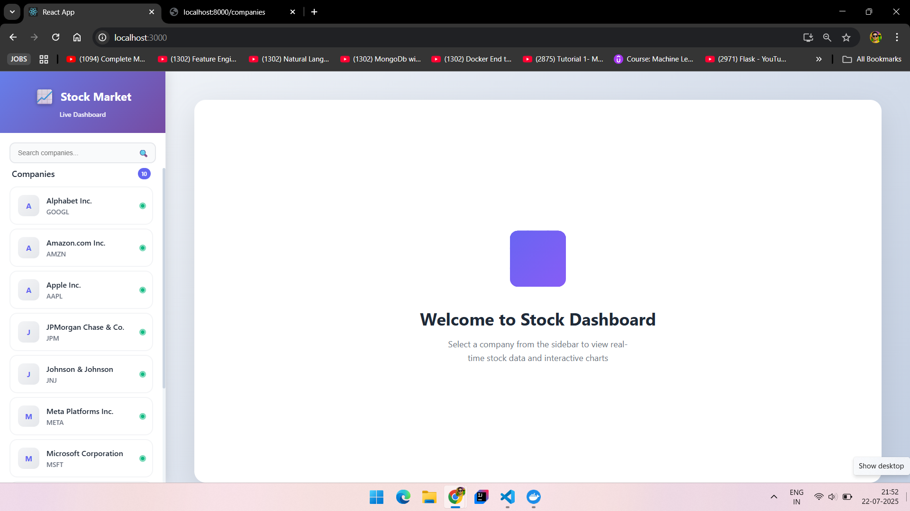
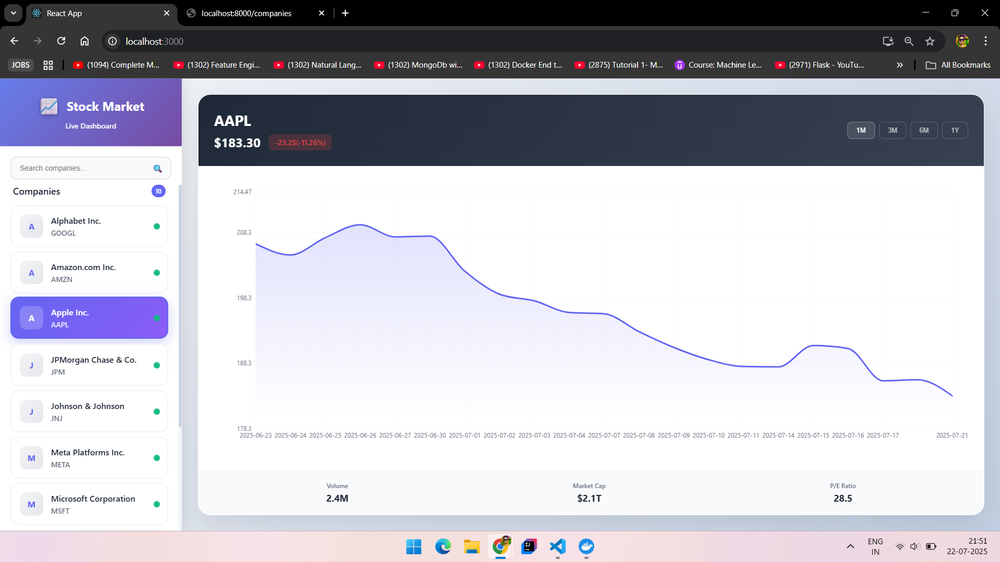
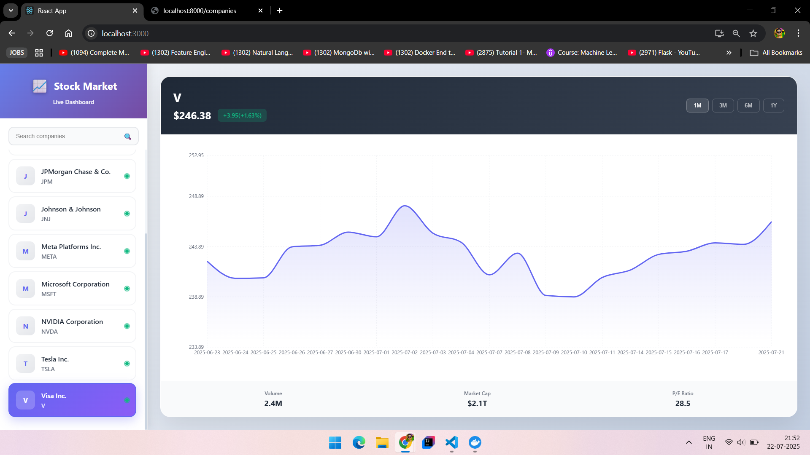

# 📊 Stock Market Dashboard

This project is a containerized full-stack stock market dashboard application that provides interactive stock price visualizations for selected companies.

## 🔧 Features
- Scrollable sidebar with 10 popular companies
- Interactive line chart for historical stock prices
- Backend API to serve company data and prices
- SQLite database for persistence (optional caching/data handling)
- Fully containerized using Docker Compose

## 🚀 Technologies Used
- **Frontend**: React, Chart.js, Axios, CSS
- **Backend**: FastAPI, yfinance, Uvicorn
- **Database**: SQLite
- **Containerization**: Docker, Docker Compose

## 📁 Folder Structure
```
stock-dashboard/
├── backend/
│   ├── main.py
│   ├── requirements.txt
│   ├── Dockerfile
│   └── stocks_data.db
├── my-app1/
│   ├── src/
│   │   ├── App.js
│   │   └── components/
│   │       ├── Sidebar.js
│   │       └── StockChart.js
│   ├── package.json
│   └── Dockerfile
├── docker-compose.yml
├── screenshot.png
└── README.md
```

## 🧠 Thought Process
To build the stock market dashboard, I focused on modularity and simplicity. The FastAPI backend serves stock data from Yahoo Finance using the `yfinance` library. The frontend, built with React and Chart.js, displays the selected company’s stock chart interactively.

SQLite is used to optionally store data. The entire stack is containerized using Docker Compose for easy development and deployment.

## ⚙️ Getting Started

### Prerequisites
- Docker & Docker Compose installed

### Run the App
```bash
docker-compose up --build
```
Then open your browser to:
- Frontend: `http://localhost:3000`
- Backend: `http://localhost:8000/companies`

## 🖼️ Screenshot

Below is the preview of the application:

## 📸 Project Output Previews











## 📌 Companies Supported
- Apple (AAPL)
- Microsoft (MSFT)
- Google (GOOGL)
- Amazon (AMZN)
- Tesla (TSLA)
- Meta (META)
- Netflix (NFLX)
- Nvidia (NVDA)
- TCS (TCS.NS)
- Infosys (INFY.NS)

---

This project demonstrates backend/frontend integration, real-time API usage, data visualization, and Dockerized app design.

Feel free to fork and modify it to add technical indicators or more financial metrics!